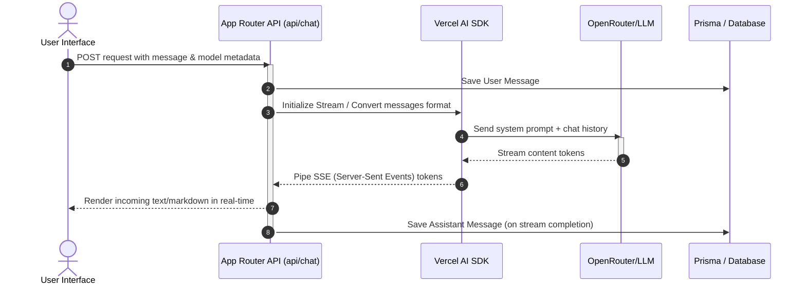

# Project Structure

This document outlines the file and directory layout of the Jahat Educational Institute project, details the purpose of each major folder, and describes the data and control flow of key modules.

---

## High-Level Folder Structure

The project follows a standard Next.js directory structure with a dedicated Prisma database folder at the root and source code housed within the `src/` directory.

```
jahat/
├── db/                   # Database schemas, migrations, and seeds
├── docs/                 # Documentation (this folder)
├── public/               # Public static assets (images, icons)
├── src/                  # Application source code
│   ├── app/              # Next.js App Router pages and API routes
│   ├── components/       # Reusable React components (UI, Admin, Agent, etc.)
│   ├── hooks/            # Custom React hooks
│   ├── lib/              # Database queries, AI configuration, authentication
│   └── types/            # TypeScript interfaces and global type declarations
├── tests/                # Jest and Playwright testing suites
└── configurations        # Config files: tsconfig, eslint, postcss, tailwind, playwright
```

---

## 1. Database Directory (`db/`)

The database configuration uses **Prisma ORM**. The directory contains:
*   [schema.prisma](file:///D:/arush/jahat/db/schema.prisma): The primary data model definition containing models for `User`, `Course`, `Testimonial`, `Contact`, `Chat`, `Message`, `Vote`, `Document`, `Suggestion`, `Stream`, `Setting`, `Post`, `Category`, and `Tag`.
*   [seed.ts](file:///D:/arush/jahat/db/seed.ts): Seeding script to initialize the database with default users, settings, courses, testimonials, and blog posts.
*   `migrations/`: SQL migration files recorded by Prisma when database updates are applied.

---

## 2. Core Application Source (`src/`)

### 2.1 App Router (`src/app/`)
Routes are organized using Next.js route groups:

| Directory | Type | Description |
| :--- | :--- | :--- |
| [src/app/(default)](file:///D:/arush/jahat/src/app/\(default\)) | Route Group | Public-facing portal including: home landing page, about section, courses catalog, blog catalog, and login page. |
| [src/app/(admin)](file:///D:/arush/jahat/src/app/\(admin\)) | Route Group | Restricted administrative panel routes (`/admin`) for managing users, courses, testimonials, blog posts, and contact queries. |
| [src/app/(agent)](file:///D:/arush/jahat/src/app/\(agent\)) | Route Group | Real-time AI chat agent interface (`/chat`). Features custom sidebar navigation, dynamic layout, and streaming answers. |
| [src/app/api](file:///D:/arush/jahat/src/app/api) | API | Core REST endpoints for public forms, uploads, course retrieval, testimonials, and general system settings. |

### 2.2 Components (`src/components/`)
Modular UI elements divided by context:
*   [ui/](file:///D:/arush/jahat/src/components/ui): Built using Radix UI primitives and styled with Tailwind CSS. Includes basic widgets (buttons, dropdowns, dialogs, inputs, data tables, carousels, sheet drawers, etc.).
*   [agent/](file:///D:/arush/jahat/src/components/agent): The building blocks of the AI agent chat workspace. Key files include:
    *   [chat.tsx](file:///D:/arush/jahat/src/components/agent/chat.tsx): Orchestrates the chat experience and streaming message views.
    *   [artifact.tsx](file:///D:/arush/jahat/src/components/agent/artifact.tsx): Splits the screen to show code edits, documents, and spreadsheets on the right side.
    *   [code-editor.tsx](file:///D:/arush/jahat/src/components/agent/code-editor.tsx): Interactive sandbox using CodeMirror.
    *   [multimodal-input.tsx](file:///D:/arush/jahat/src/components/agent/multimodal-input.tsx): Handles file attachments and prompt submissions.
*   [admin/](file:///D:/arush/jahat/src/components/admin): Shell panels, sidebars, custom data tables, and media pickers used specifically for dashboard management.
*   [blog/](file:///D:/arush/jahat/src/components/blog): Context toolbars and list styling for reading and publishing posts.

### 2.3 Custom Hooks (`src/hooks/`)
*   [use-artifact.ts](file:///D:/arush/jahat/src/hooks/use-artifact.ts): Manages state and transitions for the side-by-side interactive preview.
*   [use-scroll-to-bottom.tsx](file:///D:/arush/jahat/src/hooks/use-scroll-to-bottom.tsx): Automatic viewport scroll handling for active chat threads.
*   [use-chat-visibility.ts](file:///D:/arush/jahat/src/hooks/use-chat-visibility.ts): Toggles thread viewing settings (private vs. public).

### 2.4 Library Utilities (`src/lib/`)
Contains business logic, database queries, and AI configuration:
*   [auth.ts](file:///D:/arush/jahat/src/lib/auth.ts) & [auth.config.ts](file:///D:/arush/jahat/src/lib/auth.config.ts): Configures NextAuth.js credentials provider, session callbacks, and route security.
*   [db.ts](file:///D:/arush/jahat/src/lib/db.ts): Instantiates the Prisma Client singleton instance.
*   [queries.ts](file:///D:/arush/jahat/src/lib/db/queries.ts): Database helper queries for fetching messages, storing chat histories, auditing model usage, and stream updates.
*   `ai/`: Houses the backend system prompt, custom tool configurations (e.g. weather lookup, document creation/updating), and OpenRouter model integrations.

---

## 3. Data & Communication Flows

### 3.1 AI Chat and Streaming Workflow


### 3.2 Artifact Generation Workflow
When the AI decides to create or edit documents:
1.  The LLM issues a tool call: `createDocument` or `updateDocument` with details (title, type, content).
2.  The frontend receives the tool invocation from the streaming event and transitions the layout into a split screen.
3.  The **Artifact** component ([artifact.tsx](file:///D:/arush/jahat/src/components/agent/artifact.tsx)) handles content rendering (e.g., Markdown preview, interactive CSV spreadsheet, or CodeMirror editor for code snippets).
4.  Optionally, the AI calls `requestSuggestions` to present inline improvements which are stored and resolved in the database via the `Suggestion` schema.
